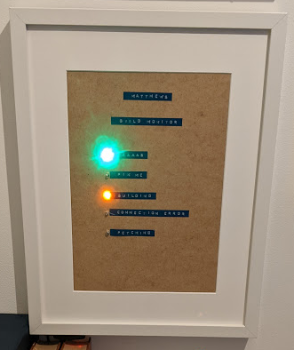

# GPIO build monitor

A small Raspberry Pi that sits on your desk and lights up to show CI status - so you can see at a glance whether your builds need attention, without checking email or keeping another browser tab open.



Inspired by the information radiators we used to have in the office. [Read the story behind it →](https://mzworthington.co.uk/guides/i-built-a-build-monitor)

## Why

- **Glanceable** - green, red, yellow, and blue LEDs instead of inbox noise or yet another tab.
- **Always on** - runs on a Pi, not your laptop. Status is visible even when your machine is closed.
- **Multi-provider** - GitHub Actions and CircleCI in one place, aggregated across repos.
- **Low cost** - a Pi Zero and a handful of LEDs; the [full build came in around £20](docs/hardware.md#shopping-list).

## How it works

The monitor fetches your configured repos, aggregates the results, and drives one or more **status outputs**. By default it polls on a fixed interval. Optionally, GitHub and CircleCI webhooks can wake a refresh immediately, with polling kept as a reconcile fallback.

| Light / UI | Meaning |
|------------|---------|
| Blue | Fetching status |
| Green | All non-running builds passed |
| Red | At least one build failed |
| Yellow (pulse) | At least one build is running |
| Purple | Connection or API error (polling continues) |

```
integrations.yaml  →  poll CI APIs (and optional webhooks)  →  aggregate  →  GPIO LEDs and/or WebSocket UI
```

Outputs are adapters behind a shared `StatusOutput` port, so the Pi LEDs and browser UI stay in sync when both are enabled.

On a dev machine, GPIO is mocked automatically. On the Pi, run with `python -O` to use real hardware.

## Quick start

```shell
git clone https://github.com/worthington10TW/gpio-build-monitor
cd gpio-build-monitor
bin/bootstrap
cp monitor/integrations.example.yaml monitor/integrations.yaml   # if bootstrap didn't
# edit integrations.yaml, export GITHUB_TOKEN / CIRCLE_CI_TOKEN
monitor check-config
bin/serve
```

See [Getting started](docs/getting-started.md) for mise, Make, and CLI details.

## Public UI (Cloudflare)

Two deployments:

- **Hosted:** [monitor.mzworthington.co.uk](https://monitor.mzworthington.co.uk) — Cloudflare Worker (UI + live status). See [worker/README.md](worker/README.md) and [infra/cloudflare](infra/cloudflare/README.md).
- **Headless:** Raspberry Pi GPIO — [docs/pi-setup.md](docs/pi-setup.md). No tunnel required for the website.

## Documentation

| Guide | Contents |
|-------|----------|
| [Getting started](docs/getting-started.md) | Local setup, CLI, development workflow |
| [Pi setup](docs/pi-setup.md) | Raspberry Pi + Cloudflare Tunnel checklist |
| [Webhooks](docs/webhooks.md) | GitHub/CircleCI webhooks on the hosted Worker |
| [Configuration](docs/configuration.md) | `integrations.yaml`, tokens, pins, logging |
| [Raspberry Pi](docs/raspberry-pi.md) | GPIO reference, systemd, auto-updates |
| [Hardware](docs/hardware.md) | Pin map, shopping list, build photos |
| [Development](docs/development.md) | Tests, releases, CI, security scanning |
| [Cloudflare](infra/cloudflare/README.md) | Tunnel + DNS Pulumi |

## Install from GitHub

```shell
pip install git+https://github.com/worthington10TW/gpio-build-monitor
monitor run --help
```

## License

[MIT](LICENSE)
