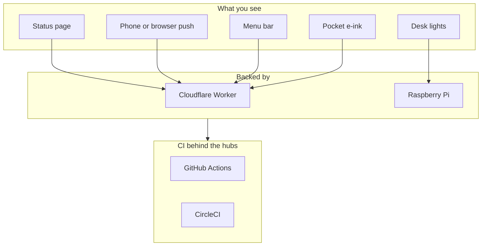
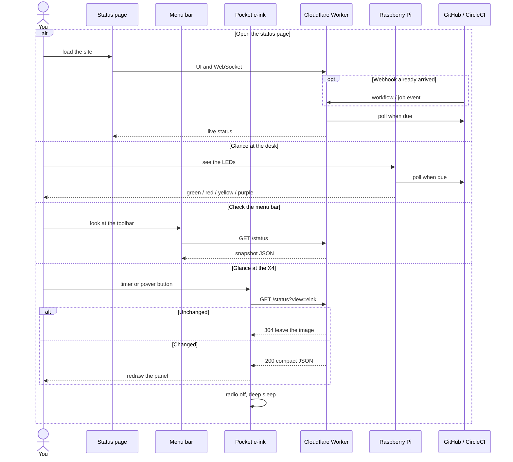
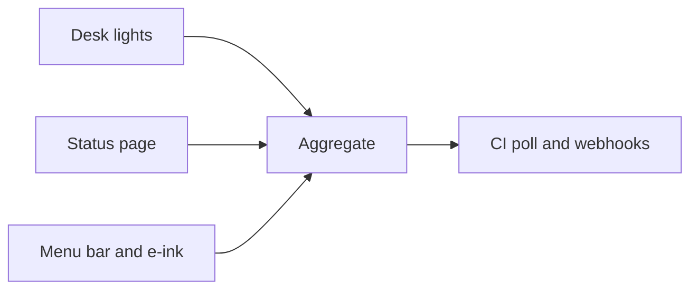

# GPIO build monitor

Glanceable CI status - on the web, or glowing on your desk.

**Live status:** [monitor.mzworthington.co.uk](https://monitor.mzworthington.co.uk)


Inspired by office information radiators. [Read the story →](https://mzworthington.co.uk/guides/i-built-a-build-monitor)

## Ways to run it

Same aggregation logic; pick the outputs you want.

| | **On the web** | **On a Pi** | **On a Mac** | **On an X4** |
|---|---|---|---|---|
| **What you get** | Public status UI + live WebSocket | Desk LEDs (optional local UI) | Menu bar extra | Pocket e-ink, deep sleep |
| **Where it runs** | Cloudflare Worker | Raspberry Pi GPIO | [SwiftBar](docs/macos.md) plugin | ESP32-C3 firmware |
| **See it** | [monitor.mzworthington.co.uk](https://monitor.mzworthington.co.uk) | Hardware on your desk | Top toolbar (polls `/status`) | 4.26" panel (samples `/status?view=eink`) |
| **Setup** | [worker/README.md](worker/README.md) · [infra/cloudflare](infra/cloudflare/README.md) · [Webhooks](docs/webhooks.md) | [Pi setup](docs/pi-setup.md) · [Hardware](docs/hardware.md) | [Mac menu bar](docs/macos.md) | [Xteink X4](docs/xteink-x4.md) |

You can use any path alone, or combine them with the same `integrations.yaml` shape. The hosted site does not depend on the Pi (no tunnel required). The Mac extra and the Xteink X4 read the hosted (or local) snapshot. They do not poll GitHub themselves. The X4 then deep-sleeps; it is not a second always-on poller.

Pick a surface first. Menu bar and e-ink do **not** poll GitHub. By default they call the same Worker as the public site (`GET /status`, with `?view=eink` on the X4). Desk lights are a separate Pi poller. You can point Mac or X4 at the Pi LAN or `bin/serve` instead; that is bring-up or a desk-only setup, not the default.



Production snapshots come from `monitor.mzworthington.co.uk`. Optional: set the Mac extra or X4 `STATUS_HOST` to a Pi (or `bin/serve`) that has `outputs.websocket` on.


### Web (hosted)

Cloudflare Worker polls GitHub Actions / CircleCI, serves the UI, and pushes updates over WebSocket. Optional provider webhooks wake an immediate refresh.

```shell
cd worker && pnpm install && pnpm deploy
# secrets + domain: see worker/README.md and infra/cloudflare/README.md
```

### Pi (headless)

A Raspberry Pi drives LEDs from the same CI config - green / red / yellow / blue / purple at a glance, even when your laptop is closed.

```shell
git clone https://github.com/mzworthington/gpio-build-monitor.git
cd gpio-build-monitor
bin/bootstrap
# then follow docs/pi-setup.md
```

## Why

- **Glanceable** - lights and a dial instead of inbox noise or another tab.
- **Always on** - hosted site stays up; Pi stays lit when your machine is shut.
- **Multi-provider** - GitHub Actions and CircleCI, aggregated across repos.
- **Low cost** - Pi Zero and a handful of LEDs; the [full build came in around £20](docs/hardware.md#shopping-list).

## How status maps

| Light / UI | Meaning |
|------------|---------|
| Blue | Fetching status |
| Green | All non-running builds passed |
| Red | At least one build failed |
| Yellow (pulse) | At least one build is running |
| Purple | Connection or API error (polling continues) |



On a dev machine, GPIO is mocked automatically. On the Pi, run with `python -O` to use real hardware.

## Local development

```shell
git clone https://github.com/mzworthington/gpio-build-monitor.git
cd gpio-build-monitor
bin/bootstrap
cp monitor/integrations.example.yaml monitor/integrations.yaml
# edit integrations.yaml, export GITHUB_TOKEN / CIRCLE_CI_TOKEN
monitor check-config
bin/serve
```

See [Getting started](docs/getting-started.md) for mise, Make, and CLI details.

## Documentation

| Guide | Contents |
|-------|----------|
| [Getting started](docs/getting-started.md) | Local setup, CLI, development workflow |
| [Pi setup](docs/pi-setup.md) | Headless Raspberry Pi + systemd |
| [Webhooks](docs/webhooks.md) | GitHub/CircleCI webhooks on the hosted Worker |
| [Push notifications](docs/push.md) | Chrome/Android fail + recovery alerts (hosted Worker) |
| [Mac menu bar](docs/macos.md) | SwiftBar extra from `GET /status` |
| [Xteink X4](docs/xteink-x4.md) | Battery e-ink client: snapshot + deep sleep |
| [Configuration](docs/configuration.md) | `integrations.yaml`, tokens, pins, logging |
| [Raspberry Pi](docs/raspberry-pi.md) | GPIO reference, systemd, auto-updates |
| [Hardware](docs/hardware.md) | Pin map, shopping list, build photos |
| [Development](docs/development.md) | Tests, releases, CI, security scanning |
| [Hosted Worker](worker/README.md) | Deploy the public UI |
| [Cloudflare infra](infra/cloudflare/README.md) | Worker custom domain (Pulumi) |

## Install from GitHub

```shell
pip install git+https://github.com/mzworthington/gpio-build-monitor
monitor run --help
```

## License

[MIT](LICENSE)
