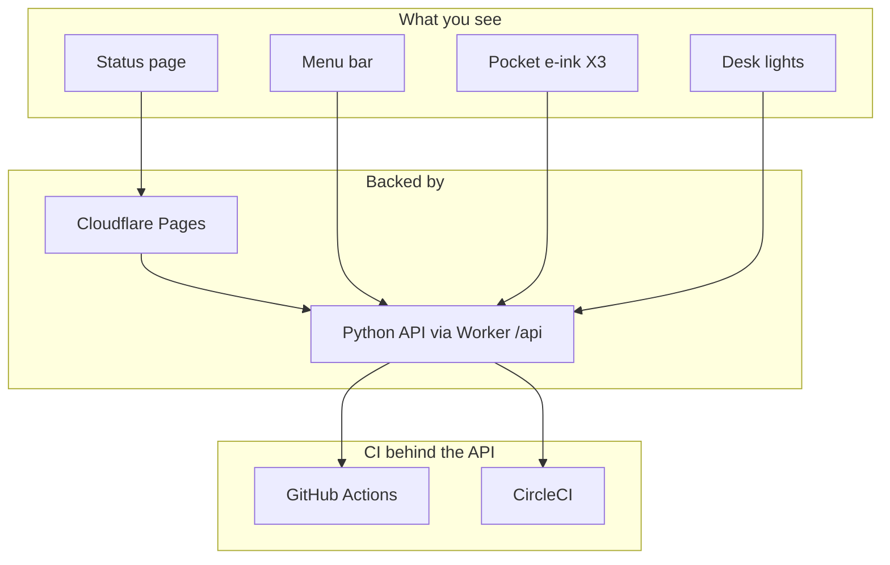
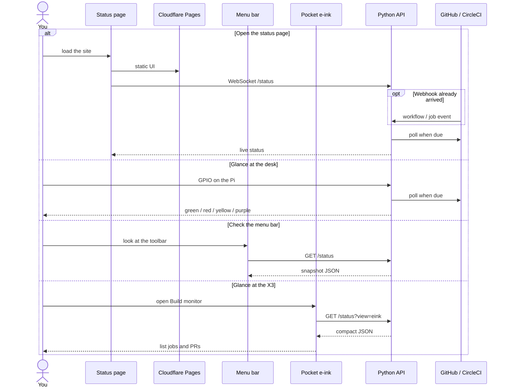
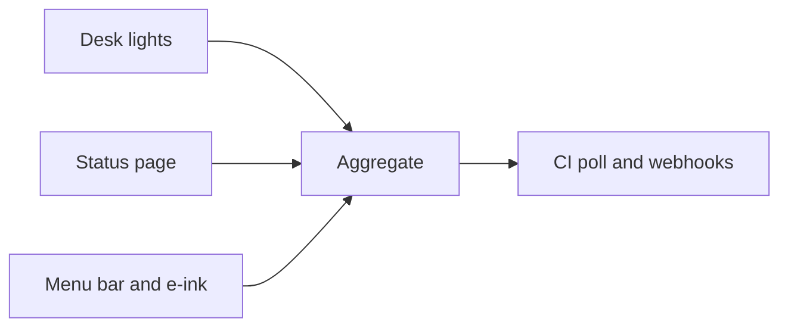

# GPIO build monitor

Glanceable CI status - on the web, or glowing on your desk.

**Live status:** [monitor.mzworthington.co.uk](https://monitor.mzworthington.co.uk)


Inspired by office information radiators. [Read the story →](https://mzworthington.co.uk/guides/i-built-a-build-monitor)

## Ways to run it

Same aggregation logic; pick the outputs you want.

| | **On the web** | **On a Pi** | **On a Mac** | **On an X3** |
|---|---|---|---|---|
| **What you get** | Public status UI | Desk LEDs | Menu bar extra | Pocket e-ink (CrossPoint) |
| **Where it runs** | Cloudflare Pages | Raspberry Pi GPIO | [SwiftBar](docs/macos.md) plugin | ESP32-C3 firmware |
| **See it** | [monitor.mzworthington.co.uk](https://monitor.mzworthington.co.uk) | Hardware on your desk | Top toolbar (polls `/api/status`) | E-ink panel (`/api/status?view=eink`) |
| **Setup** | [Web UI](monitor/device/web/README.md) · [infra/cloudflare](infra/cloudflare/README.md) | [Pi setup](docs/pi-setup.md) · [Hardware](docs/hardware.md) | [Mac menu bar](docs/macos.md) | [Xteink e-ink](docs/xteink-x3.md) |

The Pages UI and every device call the same Python API (`GET /api/status`, `/api/ws`) on `https://monitor.mzworthington.co.uk/api`. The Cloudflare Worker declares that `/api*` route and forwards it to the Python process. Desk lights subscribe to `/api/ws`; they do not poll GitHub.



Production snapshots come from the Python API. The Pages UI loads from `monitor.mzworthington.co.uk` and opens `/ws` on `MONITOR_API_ORIGIN`. Point the Mac extra and e-ink at that API.


### Web (Pages + Python API)

Cloudflare Pages serves the UI. Python polls GitHub Actions / CircleCI, serves `/status` and `/ws`, and drives GPIO. Optional provider webhooks wake an immediate refresh.

```shell
cd monitor/device/web && pnpm install && MONITOR_API_ORIGIN=https://api.example pnpm deploy
# domain: infra/cloudflare/README.md — Python API must be reachable at MONITOR_API_ORIGIN
```

### Pi (headless)

A Raspberry Pi drives LEDs from the same CI config - green / red / yellow / blue / purple at a glance, even when your laptop is closed.

```shell
git clone https://github.com/mzworthington/gpio-build-monitor.git
cd gpio-build-monitor
bin/bootstrap
# then follow docs/pi-setup.md
```

## Why

- **Glanceable** - lights and a dial instead of inbox noise or another tab.
- **Always on** - hosted site stays up; Pi stays lit when your machine is shut.
- **Multi-provider** - GitHub Actions and CircleCI, aggregated across repos.
- **Low cost** - Pi Zero and a handful of LEDs; the [full build came in around £20](docs/hardware.md#shopping-list).

## How status maps

| Light / UI | Meaning |
|------------|---------|
| Blue | Fetching status |
| Green | All non-running builds passed |
| Red | At least one build failed |
| Yellow (pulse) | At least one build is running |
| Purple | Connection or API error (polling continues) |



On a dev machine, GPIO is mocked automatically. On the Pi, run with `python -O` to use real hardware.

## Local development

```shell
git clone https://github.com/mzworthington/gpio-build-monitor.git
cd gpio-build-monitor
bin/bootstrap
cp monitor/integrations.example.yaml monitor/integrations.yaml
# edit integrations.yaml, export GITHUB_TOKEN / CIRCLE_CI_TOKEN (or put them in .env)
monitor check-config
bin/serve
# Worker UI: http://127.0.0.1:8787/
```

See [Getting started](docs/getting-started.md) for mise, Make, and CLI details.

## Documentation

| Guide | Contents |
|-------|----------|
| [Getting started](docs/getting-started.md) | Local setup, CLI, development workflow |
| [Pi setup](docs/pi-setup.md) | Headless Raspberry Pi + systemd |
| [Webhooks](docs/webhooks.md) | GitHub/CircleCI webhooks on the hosted Worker |
| [Push notifications](docs/push.md) | Chrome/Android fail + recovery alerts (hosted Worker) |
| [Mac menu bar](docs/macos.md) | SwiftBar extra from `GET /status` |
| [Xteink e-ink](docs/xteink-x3.md) | X3 CrossPoint overlay: Build monitor from `/status?view=eink` |
| [Configuration](docs/configuration.md) | `integrations.yaml`, tokens, pins, logging |
| [Raspberry Pi](docs/raspberry-pi.md) | GPIO reference, systemd, auto-updates |
| [Hardware](docs/hardware.md) | Pin map, shopping list, build photos |
| [Development](docs/development.md) | Tests, releases, CI, security scanning |
| [Hosted web UI](monitor/device/web/README.md) | Deploy the public UI |
| [Cloudflare infra](infra/cloudflare/README.md) | Pages custom domain (Pulumi) |

## Install from GitHub

```shell
pip install git+https://github.com/mzworthington/gpio-build-monitor
monitor run --help
```

## License

[MIT](LICENSE)
